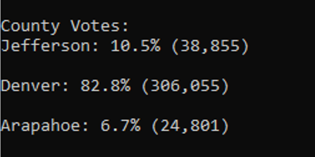
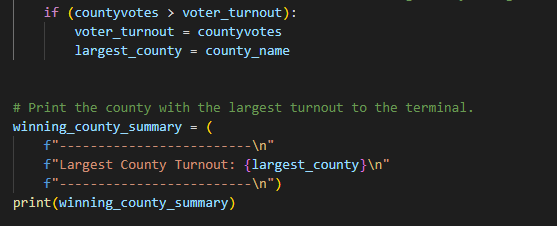
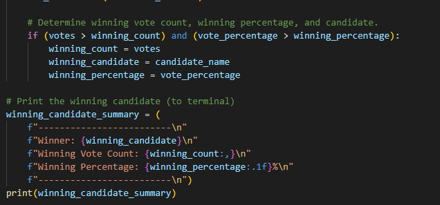
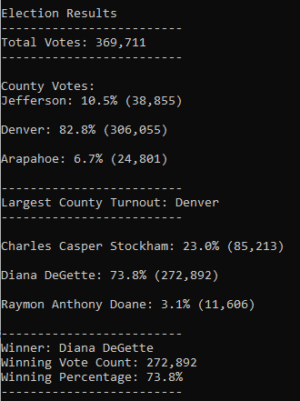

# Stock Analysis

## Overview of Project
In this project we are working with the Colorado board of elections to do an election audit of the tabulated results for a U.S. congressional precinct in Colorado. We are working with Tom one of the employees and we have been tasked with reporting the total number of votes cast, the total number of votes for each candidate and the percentage of votes for each candidate. Lastly Tom would like us to show the winner of the election based on the popular vote.

### Purpose
The main purpose in this analysis is to determine if there is a way to automate this process using Python rather than manually doing it in Excel. We will explore some steps to do this below.

## Analysis and Challenges
We were provided a CSV file that contained header records and data records. The data records were the Ballot ID, County, and full candidate name. 

The first step was to create a way to open the csv file, read the contents and order them in a way that made sense. We used the import csv and import os functions to make the process of setting variables for input and output files easier.

Once we had set up to read in the file we created dictionaires to contain the different aspects of the data we needed to analyze. We will go over the data collected and break it down by section below.

- Total number of votes - 369,711  
We calculated the total number of votes cast in the election by initializing a counter and then using a for loop to cycle through the rows and add to the total vote count until the final result was returned.
        

- Number and percentage of votes for each county  
The election board wanted us to provide the total number of votes in each county in the data and provide a percentage of votes based on the total for each. This was a process of a simple for loop to cycle through the data based on the county name, and tally votes for each county.

As you can see in the above picture from the terminal printout, each county is represented as are the percentage of the total votes in each and a tally of the total votes in each county. We used the below code to achive this:

countyvote_percentage = float(countyvotes) / float(total_votes) * 100
        county_results = (
            f"{county_name}: {countyvote_percentage:.1f}% ({countyvotes:,})\n")

- Which county had the largest number of votes  
The board decided that they also wanted to see which county had the largest number of votes (highest voter turnout) so we needed to add a section to achive this. Since we already had the data for each county we just needed to add an if statement to determine which county had the highest number of votes. We achived this with the below code:

- Number and percentage of votes for each candidate  
In order to present this data we created a similar for loop as we did to tally the per county votes to count the number of votes for each candidate, add the candidate to the list, and then cycle through the rows adding up the number of votes for that candidate.

        if candidate_name not in candidate_options:
        candidate_options.append(candidate_name)
        candidate_votes[candidate_name] = 0
        candidate_votes[candidate_name] += 1

This allowed us to tally up the total votes for each candidate and then apply some simple math to output the percentage of votes based on the total votes for each candidate.

- Winning candidate with vote count and percentage of the total votes  
Lastly we needed to present the winning candidate and total vote count for that candidate as well as a percentage of the total of votes for the candidate. Since we already have the data for each candidate this was a similar process to achiveing the county with the largest number of votes. The below code demonstrates the process to analyse this data and print the outcome.

### Summary

The above image shows the final result of the data analysis. This script is highly adaptable to any election analysis scenario. Here are a couple of examples that would 
